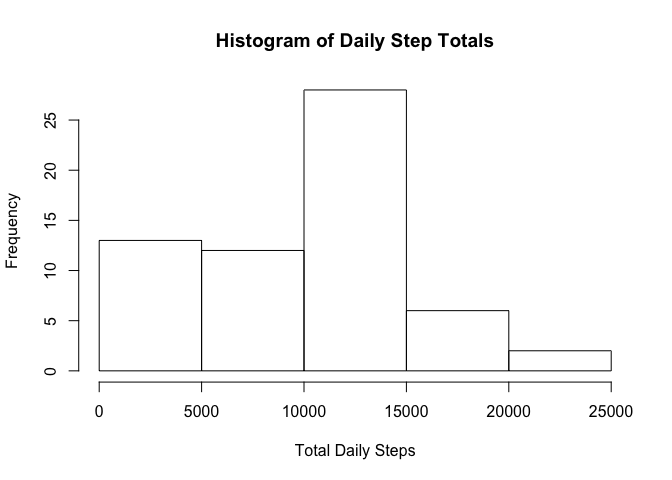
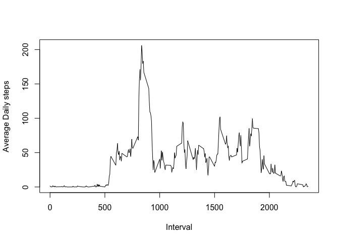
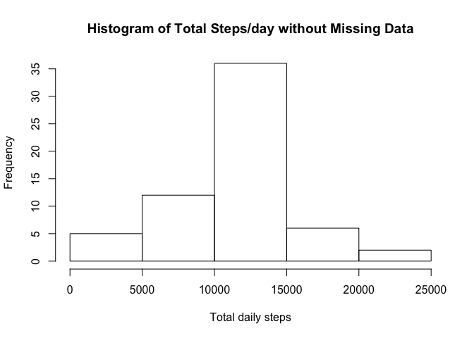
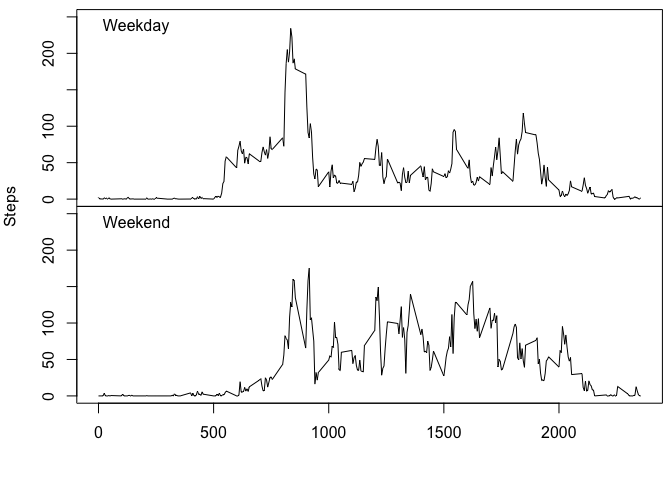

# Reproducible Research: Peer Assessment 1


## Loading and preprocessing the data
Load the data from "activity.csv".


```r
activity_data <- read.csv("activity.csv")
```

## What is mean total number of steps taken per day?
Calculates the total number of steps taken per day and creates a histogram steps taken each day. The calculates the mean and median of the total number of steps taken per day. 


```r
library(dplyr)
activity_summary <- activity_data %>% select(steps, date) %>% group_by(date) %>% summarise(total_steps = sum(steps, na.rm = TRUE))
hist(activity_summary$total_steps, xlab = "Total Daily Steps", main = "Histogram of Daily Step Totals")
```

<!-- -->

```r
daily_mean <-mean(activity_summary$total_steps, na.rm = TRUE)
daily_median <-median(activity_summary$total_steps, na.rm = TRUE)
```

The average number of steps taken per day is 9354.23 and the median is 10395.


## What is the average daily activity pattern?

```r
interval_summary <- activity_data %>% select(steps, date, interval) %>% group_by(interval) %>% summarise(average_steps = mean(steps, na.rm=TRUE))
plot(interval_summary$interval, interval_summary$average_steps, type = 'l', ylab = "Average Daily steps", xlab = "Interval")
```

<!-- -->

```r
most_steps <- interval_summary[interval_summary$average_steps == max(interval_summary$total_steps),1]
```

```
## Warning: Unknown or uninitialised column: 'total_steps'.
```

```
## Warning in max(interval_summary$total_steps): no non-missing arguments to
## max; returning -Inf
```

```r
most_steps <- most_steps$interval[1]
```

The time interval with the maximum number is: ``NA``.

## Inputing Missing Values
Missing vaues will be replaces with the average value for that interval rounded to the nearest step. 

```r
total_missing <- nrow(activity_data[is.na(activity_data$steps),])


replace_data <- activity_data
interval_averages <- replace_data %>% select(steps, date, interval) %>% group_by(interval) %>% summarise(interval_average = round(mean(steps, na.rm=TRUE)))
for(row in 1:nrow(replace_data)){
  if(is.na(replace_data$steps[row])){
    replace_data$steps[row] <- interval_averages[interval_averages$interval==replace_data$interval[row],]$interval_average
  }
}

replace_summary <- replace_data %>% select(steps, date) %>% group_by(date) %>% summarise(total_steps = sum(steps, na.rm = TRUE))
hist(replace_summary$total_steps, main = "Histogram of Total Steps/day without Missing Data", xlab = "Total daily steps")
```

<!-- -->

```r
replace_mean <- mean(replace_summary$total_steps)
replace_median <- median(replace_summary$total_steps)
```
There are 2304 missing values in the data set. The missing data was relaced with the average for the interval with the missing data. The new avarage is 10765.64, this is a change of 1411.41 steps. The new median is 10762, this is a change of 367 steps.

## Are there differences in activity patterns between weekdays and weekends?


```r
weekday_labels <- c('Monday', 'Tuesday', 'Wednesday', 'Thursday', 'Friday')
activity_data$weekday <- factor(weekdays(as.Date(as.character(activity_data$date))) %in% weekday_labels, levels=c(FALSE, TRUE), labels=c('weekend', 'weekday'))

weekday <- activity_data[activity_data$weekday == "weekday",]
weekend <- activity_data[activity_data$weekday == "weekend",]

weekday_summary <- weekday %>% select(steps, date, interval) %>% group_by(interval) %>% summarise(average_steps = mean(steps, na.rm=TRUE))

weekend_summary <- weekend %>% select(steps, date, interval) %>% group_by(interval) %>% summarise(average_steps = mean(steps, na.rm=TRUE))

par( mfrow = c(2,1))
par(mar = c(0,0,0,0), oma = c(4,4,.5,.5))
plot(weekday_summary$interval, weekday_summary$average_steps, type = 'l', xaxt = 'n',ann = FALSE, ylim = c(0,250))
mtext("Weekday", side = 3, adj = 0.05, line = -1.3)
plot(weekend_summary$interval, weekend_summary$average_steps, type = 'l', ylim = c(0,250), xlab = "Interval")
mtext("Weekend", side = 3, adj = 0.05, line = -1.3)
mtext("Steps", 2, 3, outer=TRUE, las=0)
```

<!-- -->
